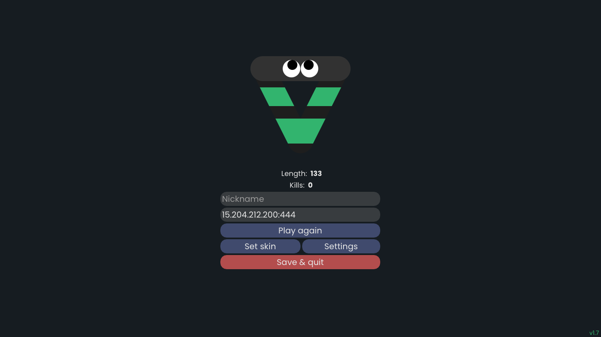
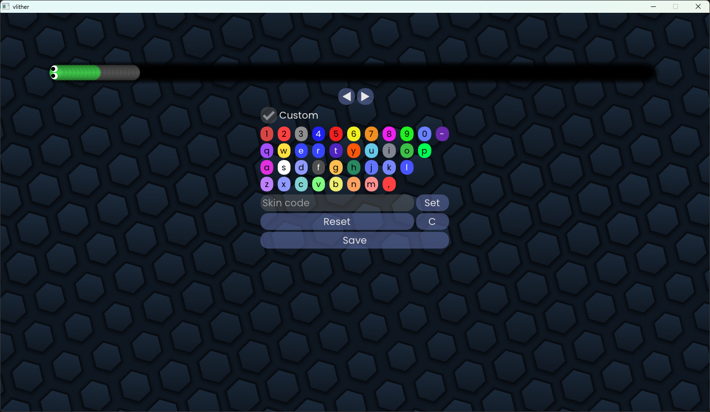
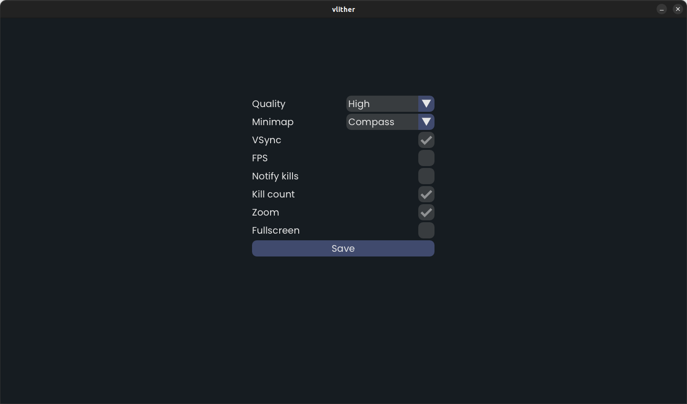
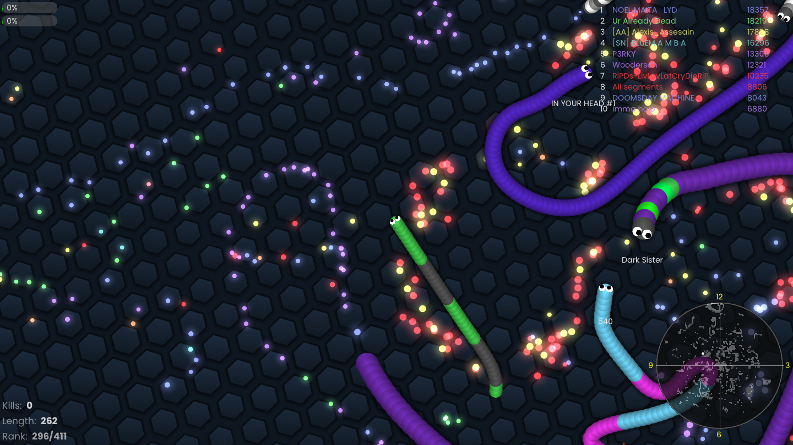

# Vlither
## A Desktop Client for Slither.io

Vlither is a client for [Slither.io](https://slither.io) which can run outside the browser. It is written in C and uses Vulkan for rendering all the graphics, thus providing better CPU/GPU utilization and faster rendering. A lot of the game-play code is a word-for-word C translation of the original JavaScript client (protocol version 14). It has only been tested on Windows (AMD and Intel) and Ubuntu (Intel).

### Running Instructions
No dependencies are required to run the program. If your GPU supports at least Vulkan 1.0, you're good to go.
- Download the latest [release](https://github.com/for-loop9/vlither/releases/tag/1.1).
- Enjoy!

### Build Instructions
Prerequisites
- [Premake](https://premake.github.io) for generating the makefiles
- [Vulkan SDK](https://www.lunarg.com/vulkan-sdk)
- [Python 3](https://www.python.org/downloads) (for automated shader compilation)
- GCC (mingw-w64 on Windows)
- GDB (mingw-w64 on Windows) if you plan to debug
- Make (mingw-w64 on Windows)
- X11 dependencies (only for Linux, [see here](https://www.glfw.org/docs/latest/compile.html))

On Windows, the program is developed using [MSYS2](https://www.msys2.org) to get access to GCC, GDB, and Make with mingw-w64 tool chain. It has **_not_** been tested with MSVC or Cygwin. It will most likely not work with MSVC out of the box due to the use of POSIX Threads API.

Premake5 should be installed and put in path. Make sure `VULKAN_SDK` environment variable is set properly if on Windows.

```bash
git clone https://github.com/for-loop9/vlither.git
cd vlither/scripts
python compile_shaders.py
cd ..
premake5 --file=build.lua gmake2
cd build/makefiles
make config=debug # or config=release for release mode
cd ../..
build/bin/app
```
You may also work on the project with VS Code by opening the `.code-workspace` file. All the build tasks (configure first, then build) and launch configurations (debug only) have been set. Make sure you have the required extensions installed:
- [C/C++ tools](https://marketplace.visualstudio.com/items?itemName=ms-vscode.cpptools)
- [Makefile tools](https://marketplace.visualstudio.com/items?itemName=ms-vscode.makefile-tools)
## Features

- Supports all 66 skins
- Custom skins
- Server selection
- Zoom
- Low/high quality
- Leader board
- Minimap
- Kill count

## Planned
- Antennas
- Accessories
- Better skin rendering
- Light theme
- Multisampling
- Android
- Mac

## Tools Used

The following libraries have been used to develop Vlither:

- [GLFW](https://www.glfw.org) - For windowing and handling input.
- Ignite - My own lightweight wrapper (sort of an engine?) over [Vulkan](https://vulkan.lunarg.com) for rendering fast 2D graphics.
- [Mongoose](https://mongoose.ws) - For networking.
- [Cimgui](https://github.com/cimgui/cimgui) - A C wrapper for [Dear ImGui](https://github.com/ocornut/imgui), a wonderful immediate mode UI library.

## Gallery
Here are a few screenshots:
|  |  |
|:----------------------------:|:----------------------------:|

|  |  |
|:----------------------------:|:----------------------------:|

## License
This project is licensed under the GNU General Public License v3.0 - see the [LICENSE](./LICENSE) file for details.

### Notice
This project was made entirely by one person - me. I play-test it for long hours and upon coming across any bugs, I fix them. It is unlikely that you will come across any while using this program. In the off chance that you do, I would really appreciate if you'd let me know by opening up an issue.
